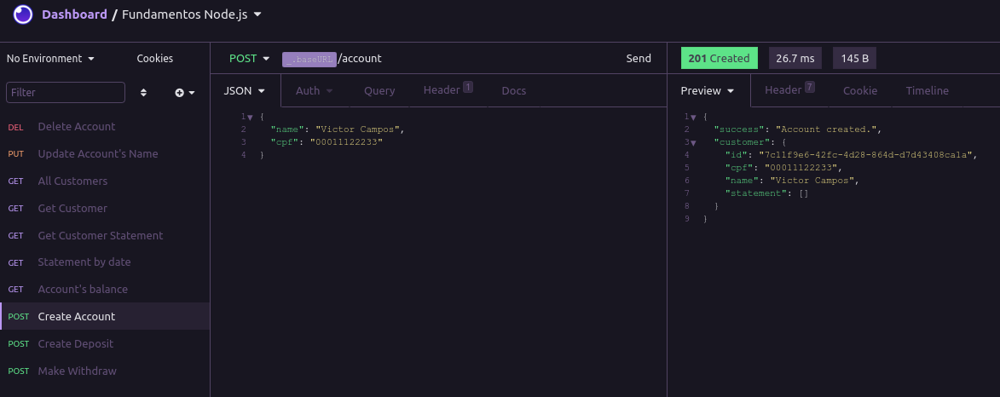

<h1 align="center">
  Criando uma API financeira - FinAPI
</h1>

<p align="center">
  Projeto criado durante as aulas do <strong>Ignite</strong> da Rocketseat.
  Nesse projeto pude criar uma API utilizando o padrão de arquitetura REST e colocar
  em prática os métodos https, códigos de retorno e os parâmetros de requisições
  para fazer as operações financeiras de acordo com os requisitos e as regras de negócio.
</p>

<p align="center">
  
  <a href="https://opensource.org/licenses/MIT">
    
  </a>
</p>

[//]: # (Add your gifs/images here:)
<p align="center">
  
</p>

<hr />

### Requisitos

- [x] Deve ser possível criar uma conta
- [x] Deve ser possível buscar o extrato bancário do cliente
- [x] Deve ser possível realizar um depósito
- [x] Deve ser possível realizar um saque
- [x] Deve ser possível buscar o extrato bancário do cliente por data
- [x] Deve ser possível atualizar dados da conta do cliente
- [x] Deve ser possível obter dados da conta do cliente
- [x] Deve ser possível excluir uma conta
- [x] Deve ser possível retornar o saldo total de uma conta 

### Regras de negócio

- [x] Não deve ser possível cadastrar uma conta com CPF já existente
- [x] Não deve ser possível buscar extrato de uma conta não existente
- [x] Não deve ser possível fazer depósito em uma conta não existente
- [x] Não deve ser possível fazer saque em uma conta não existente
- [x] Não deve ser possível realizar uma saque quando o saldo da conta for insuficiente
- [x] Não deve ser possível excluir uma conta não existente
- [x] Não deve ser possível retornar o saldo total de uma conta não existente 

### Como utilizar:
Você precisa ter instalado na sua máquina o [Node.js](https://nodejs.org/en/) para poder rodar o projeto e um software para poder visualizar o resultado das requisições de acordo com url, como [Insomnia](https://insomnia.rest/), [Postman](https://www.postman.com/), etc.
   
#### Passos:

##### 1. Clone o repositório.

```
  $ git clone https://github.com/viictorcamposs/finAPI
```
##### 2. Abra o projeto no editor de sua preferência.

##### 3. No seu terminal, instale os pacotes necessários.

```
  $ yarn 
  ou 
  $ npm install
```

##### 4. Show de bola! Agora inicie o servidor

```
  $ yarn dev 
  ou 
  $ npm run dev
```
##### 5. Abra seu software para desenvolvimentos de APIs e é só começar a fazer as requisições de acordo com as rotas.
